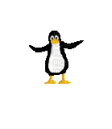

  

<h2><code>&gt; Mariana Alice _</code></h2>

 

### `//` Systems & Infrastructure

### `//` Web Ecosystem

### `//` estatísticas

  
  

<picture>
  <source media="(prefers-color-scheme: dark)" srcset="https://raw.githubusercontent.com/m4halic3/m4halic3/output/github-contribution-grid-snake-dark.svg?v=2">
  <source media="(prefers-color-scheme: light)" srcset="https://raw.githubusercontent.com/m4halic3/m4halic3/output/github-contribution-grid-snake.svg?v=2">
  
</picture>

### `//` contato

 

  

